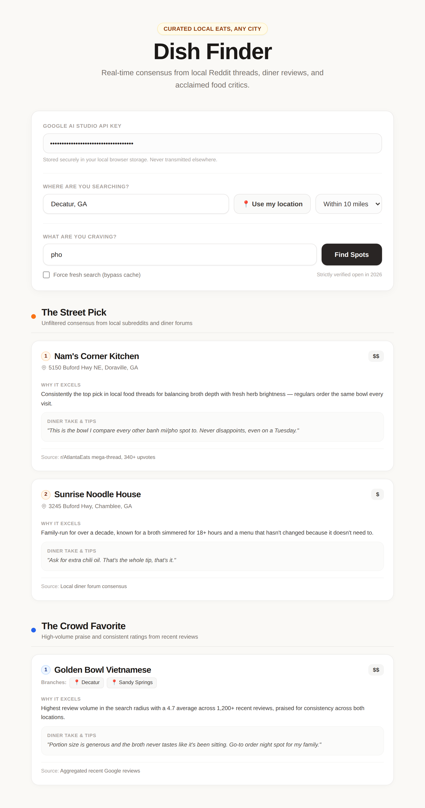

# Dish Finder

Find verified, currently-open spots for one specific dish, near any location you pick — not a general restaurant browser, a dish-specific one.

**Live demo:** https://vibhavagarwal.github.io/foodfinder/index.html


*Illustrative screenshot — the location/dish/results shown above are mocked sample data for this demo image, not a live search.*

## The problem

"Best restaurant near me" is a solved problem; "best *pho*, specifically, within 5 miles of where I actually am" is not. Answering that well normally means manually cross-referencing a Reddit thread, a pile of Google reviews, and whatever the local food critic wrote — and checking that the place everyone's still recommending hasn't quietly closed. Dish Finder does that cross-referencing for you, scoped to a dish, a location, and a distance you choose.

## What's distinctive

- **Three-lens framing, not one score.** Every search returns three separate takes on the same dish — community consensus ("The Street Pick"), review volume ("The Crowd Favorite"), and press coverage ("The Critic Pick") — because those three signals don't agree, and treating them as one aggregate rating hides that.
- **Location isn't hardcoded.** The app used to only search metro Atlanta; it now takes any location (typed, or your current position via geolocation) and a radius from 1 to 50 miles, and rebuilds its search instructions around that.
- **Traceability over star ratings.** Every recommendation carries a "why," a diner quote, and a named source, not just a number.
- **No backend to operate.** It's three static files. You bring your own free Gemini API key; there's nothing of mine in the request path to keep running, pay for, or go down.

## Demo

The live URL above is the real thing — you'll need your own free Google AI Studio API key to run a search (see Setup). The screenshot embedded in this README uses mocked results instead of a real query, so a reviewer without a key can still see the actual UI and card layout at a glance.

## Key decisions

- **Static single-file PWA, no server.** Keeps hosting free (GitHub Pages) and removes an entire category of things that can break or need maintaining.
- **Bring-your-own-key.** The Gemini key is typed into the page, stored in `localStorage`, and used directly from the visitor's browser. No account system, no API cost or quota exposure on my end.
- **Distance as a prompt constraint, not a geofence.** There's no restaurant database to filter against, so "within N miles of X" is an instruction given to the model alongside Google Search grounding, not a computed radius check. That's the main tradeoff of this architecture — see Limitations.
- **Geolocation via free reverse-geocoding.** The "Use my location" button calls the browser's Geolocation API, then turns the coordinates into a place name via OpenStreetMap's free Nominatim API — no Google Maps key or billing required for that step.
- **Network-first service worker.** The app shell now fetches fresh over the network whenever online and only serves the cached copy if that fails, so returning visitors see updates without a forced hard-refresh.

## Setup & validation

```bash
git clone https://github.com/vibhavagarwal/foodfinder.git
cd foodfinder
python3 -m http.server 8000
# open http://localhost:8000/index.html
```

Serve it rather than opening `index.html` directly — the service worker and the geolocation permission prompt both require a secure context (`https://` or `localhost`), and `file://` doesn't qualify.

1. Get a free key at [aistudio.google.com](https://aistudio.google.com/apikey) and paste it into the API key field.
2. Enter a location (or click "Use my location") and pick a radius.
3. Enter a dish and click "Find Spots."

There's no build step, no dependencies to install, and no test suite — it's plain HTML/CSS (Tailwind, loaded from CDN)/vanilla JS, so "it works in a real browser" is the validation.

## Limitations

- **Requires a Gemini API key.** Without one, the app is fully static and does nothing — this is the direct cost of the no-backend, no-cost-to-me architecture.
- **Radius isn't geofenced.** Because distance is a soft instruction to the model rather than a computed check, an occasional result can land slightly outside the chosen radius.
- **Reverse-geocoded location labels vary in quality**, since they depend on how OpenStreetMap has that specific area tagged.
- **Result freshness depends on the model's web search that day.** There's no independent freshness guarantee beyond what Gemini's grounding surfaces.
- **No rate-limiting protection.** Repeated searches with "bypass cache" checked make repeated billed calls against the visitor's own key — their cost to manage, not something the app guards against.

## Roadmap

- Real geocoding plus distance calculation, so the radius is enforced rather than requested
- A short per-location search history
- Clear, specific error messaging for invalid or rate-limited API keys (today it just surfaces the raw API error)
- A way to export or share a result set

## Privacy & data

There is no backend and no analytics. Your Gemini API key lives only in your browser's `localStorage` and is sent directly from your browser to Google's Generative Language API — it never passes through anything I control. If you use "Use my location," your coordinates go directly from your browser to OpenStreetMap's Nominatim API, client-side only, purely to turn them into a place name. Search results are cached in `localStorage` per query to avoid repeat calls; clearing your browser storage clears all of it. Nothing here is collected, logged, or stored anywhere but your own browser.

## License

MIT — see [LICENSE](LICENSE).

## How this project was built

I set the product direction: the three-lens category framing, what "verified open" should mean, the bring-your-own-key approach, the location/radius UX, and which of the AI's suggestions to accept, reject, or change. AI coding agents (Claude Code) did the implementation — the location and radius search feature, two service-worker bugfixes (a stale-cache issue and the switch to a network-first strategy), and this documentation.

To keep that reliable, each change was scoped as its own bounded task, tested by actually running the app in a browser rather than just reading the diff, and committed individually with a rationale in the message — so the git history reads as a record of what changed and why, not one undifferentiated drop. I reviewed and accepted every change before it shipped; nothing here merged without me looking at it first.
